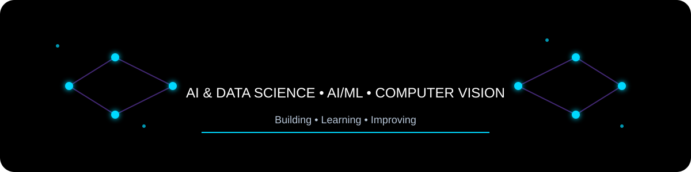
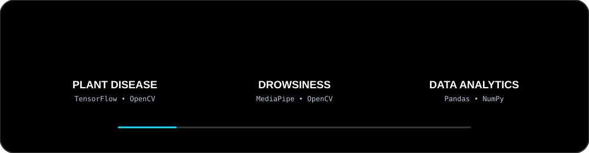
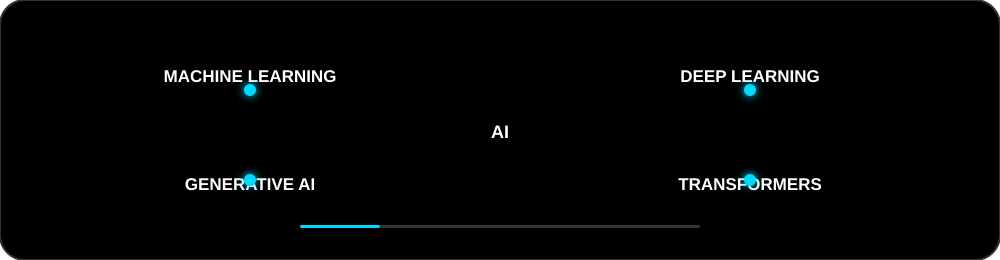

<div align="center">



<br><br>

[](https://git.io/typing-svg)

<br>

[](https://github.com/subramani2006)
[](https://www.linkedin.com/in/subramani-umaiyaraj2006/)
[](mailto:subramaniu2006@gmail.com)

<br>


</div>

---

<div align="center">


</div>

---

## 👨‍💻 About Me

B.Tech Artificial Intelligence and Data Science student passionate about building AI-driven solutions, machine learning systems, computer vision applications, and data analytics projects.

- 🔭 Interested in **Artificial Intelligence, Machine Learning, Computer Vision and Generative AI**
- 💻 Working with **Python, C++, SQL and Machine Learning**
- 📊 Interested in **Data Analytics and intelligent systems**
- 🌱 Currently improving my **software engineering and AI/ML skills**
- 🎯 Open to **AI/ML and Software Engineering internships**
- 🧩 Practicing **Data Structures & Algorithms**

---

<div align="center">



</div>

---

## 🚀 Featured Projects

### 🌱 Plant Disease Classification

<details>
<summary><b>View Project Details</b></summary>

Transfer learning framework for automated plant disease classification using deep learning and image processing.

**Tech Stack:** `Python` `TensorFlow` `Keras` `OpenCV`

**Key Work:**

- Applied transfer learning using pre-trained CNN models
- Implemented image preprocessing and augmentation
- Developed disease prediction functionality
- Worked on improving model performance

</details>

---

### 🚗 Driver Drowsiness Detection

<details>
<summary><b>View Project Details</b></summary>

Vision-based driver drowsiness detection and safety monitoring system.

**Tech Stack:** `Python` `OpenCV` `MediaPipe` `TensorFlow`

**Key Work:**

- Implemented facial landmark detection
- Monitored eye closure and blink patterns
- Detected yawning using computer vision
- Developed real-time detection functionality
- Implemented an alert mechanism

</details>

---

### 🎓 Student Performance Analysis

<details>
<summary><b>View Project Details</b></summary>

Data analytics project for analyzing student performance and identifying students who may require additional academic support.

**Tech Stack:** `Python` `Pandas` `NumPy` `Matplotlib`

**Key Work:**

- Data cleaning and preprocessing
- Exploratory data analysis
- Student performance analysis
- Data visualization
- Identification of at-risk students
- Actionable insights

🔗 [View Repository](https://github.com/subramani2006/student_performance_in_exams)

</details>

---

### 🛒 E-Commerce Sales Analysis

<details>
<summary><b>View Project Details</b></summary>

Data analytics project focused on sales performance, customer behavior, regional trends and business insights.

**Tech Stack:** `Python` `Pandas` `NumPy` `Matplotlib`

**Key Work:**

- Data cleaning and preprocessing
- Sales and revenue analysis
- Monthly trend analysis
- Regional analysis
- Customer review analysis
- Business insights

🔗 [View Repository](https://github.com/subramani2006/Ecommerce_Sales_Analysis)

</details>

---

<div align="center">



</div>

---

## 🤖 AI ROBOT GAME — NEURAL//CORE

<p align="center">
  <a href="https://subramani2006.github.io/subramani2006/assets/ai-robot-game/">
    
  </a>
</p>

<p align="center">
  <b>⚡ Enter the AI battlefield. Collect energy cores. Survive the threats. ⚡</b>
</p>

<p align="center">
  <code>W A S D</code> Move &nbsp;•&nbsp;
  <code>SHIFT</code> Boost &nbsp;•&nbsp;
  <code>P</code> Pause
</p>

---

## 🛠️ Tech Stack

### Languages

<p align="center">


</p>

### AI / ML

<p align="center">


</p>

### Data & Computer Vision

<p align="center">


</p>

### Developer Tools

<p align="center">


</p>

---

## 🧠 AI / ML Expertise

| Domain | Proficiency | Focus |
|---|---|---|
| 🤖 Machine Learning | Intermediate | Model development & evaluation |
| 🧠 Deep Learning | Intermediate | TensorFlow, Keras, Neural Networks |
| 👁️ Computer Vision | Intermediate | OpenCV, MediaPipe, Image Processing |
| 📊 Data Analytics | Intermediate | Pandas, NumPy, Matplotlib, EDA |
| ✨ Generative AI | Learning | LLMs, RAG, Transformers |

---

## 💼 Experience

### 🤖 Artificial Intelligence & Machine Learning Intern

**Pluto Academy**

- Worked on practical Artificial Intelligence and Machine Learning concepts
- Applied Python and machine learning techniques to project-based tasks
- Strengthened practical understanding of AI/ML workflows

**Skills:** `Python` `Machine Learning` `Artificial Intelligence`

---

### 📊 Data Analytics Intern

**Pluto Academy**

- Worked on practical data analytics projects
- Performed data cleaning, exploratory data analysis and visualization
- Used Python-based data analysis tools to derive insights from datasets

**Skills:** `Python` `Pandas` `NumPy` `Matplotlib` `Data Analytics`

---

## 🏆 Achievements

<div align="center">

| 🏅 Achievement | 📌 Details |
|---|---|
| 🎓 Academic Achievement | **97.50%** in Higher Secondary Education |
| 🏆 School Achievement | **100%** in 10th Standard |

</div>

---

## 📜 Certifications

- 🎓 **Pluto Academy** — Artificial Intelligence & Machine Learning Internship
- 📊 **Pluto Academy** — Data Analytics Internship
- 🐍 **NPTEL** — Python for Data Science
- ✨ **Tata Group (Forage)** — GenAI Powered Data Analytics Job Simulation

---

## 💻 Coding Profiles

<div align="center">

### 🟠 LeetCode

[](https://leetcode.com/u/SubramaniU/)

### 🟢 GeeksforGeeks

[](http://geeksforgeeks.org/profile/subramanmxp5)

</div>

---

## 🔥 GitHub Streak

<div align="center">


</div>

---

## 🎯 Current Focus

```yaml
Learning:
  - Data Structures & Algorithms
  - Machine Learning
  - Deep Learning
  - Generative AI

Building:
  - AI/ML projects
  - Computer Vision applications
  - Data Analytics projects

Exploring:
  - Large Language Models
  - RAG
  - Transformers
  - AI-powered applications

Open To:
  - AI/ML Internships
  - Software Engineering Internships
  - Collaboration on AI projects
---

## Connect With Me

<div align="center">

[](https://www.linkedin.com/in/subramani-umaiyaraj2006/)

[](https://github.com/subramani2006)

[](mailto:subramaniu2006@gmail.com)

</div>

---

<div align="center">

### Building AI. Solving Problems. Learning Continuously.

</div>
